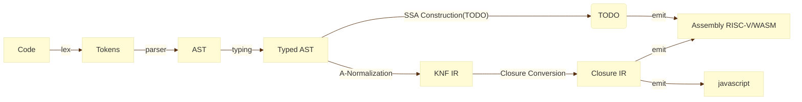

# 环境
初始化：

moon 0.1.20250801 (edae1ae 2025-08-01)
```shell
git submodule update --init --recursive

cd riscv_rt
zig build

cd ./libriscv/emulator
./build.sh

cd ../..
cp ./libriscv/emulator/rvlinux ./
```

# 流程



# 命令

生成 riscv 汇编并编译运行 

```shell
./script/single_run.sh contest-2025-data/test_cases/mbt/conv_pool.mbt
```

测试全部

```shell
./script/run_test.sh
```

闭包 IR 

```shell
moon run src/bin/main.mbt -- --closure-interpreter <input>
moon run src/bin/main.mbt -- --closure-interpreter contest-2025-data/test_cases/mbt/ack.mbt
```

## SSA

静态单赋值形式（Static Single Assignment, SSA）是一种中间表示形式，其中每个变量只被赋值一次。这种形式简化了数据流分析和优化。

生成 SSA 输出到终端：
```shell
moon run src/bin/main.mbt -- --ssa-interpreter contest-2025-data/test_cases/mbt/ack.mbt
```

生成 RISC-V 汇编代码并保存到 out.s：
```shell
moon run -g src/bin/main.mbt -- contest-2025-data/test_cases/mbt/ack.mbt -o out.s
```
