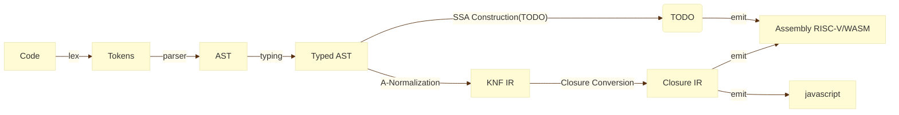

# 环境
初始化：

moon 0.1.20250801 (edae1ae 2025-08-01)
```shell
git submodule update --init --recursive

cd riscv_rt
zig build

cd ./libriscv/emulator
./build.sh

cd ../..
cp ./libriscv/emulator/rvlinux ./
```

# 流程



# 命令

生成 riscv 汇编并编译运行 

```shell
./single_run.sh contest-2025-data/test_cases/mbt/conv_pool.mbt
```

测试全部

```shell
./new_run_test.sh
```
